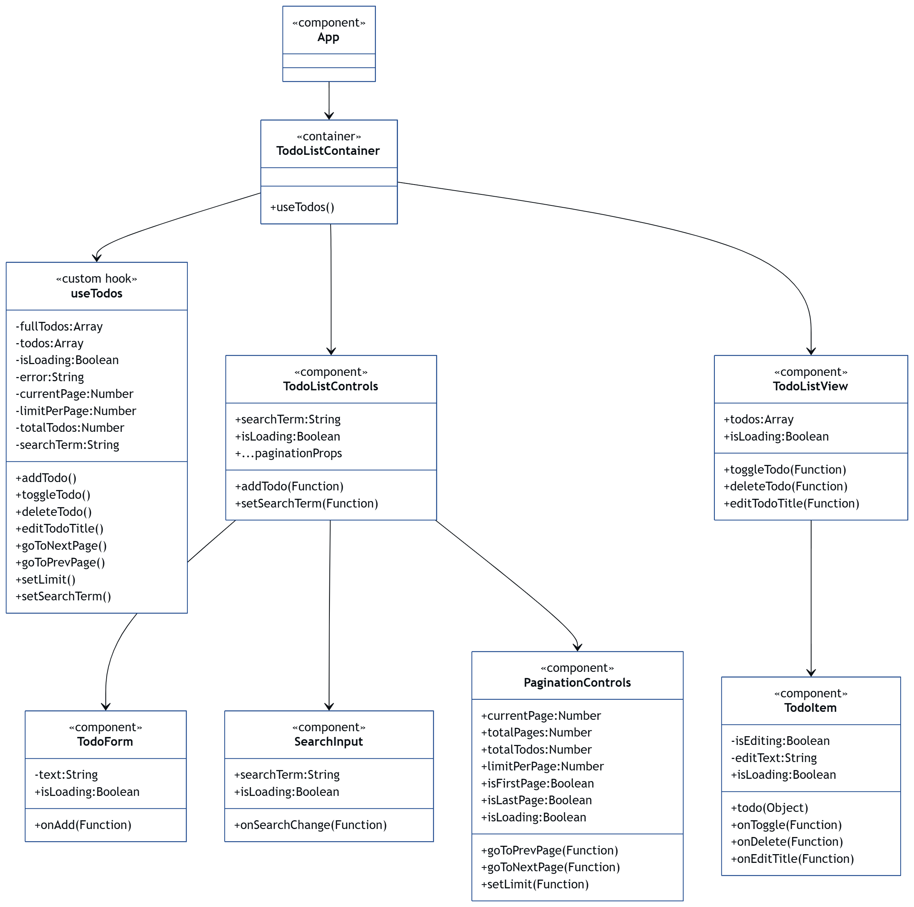

На діаграмі зображено потік даних у додатку To-Do List.
Вгорі знаходиться App, який підключає TodoListContainer — це контейнерний компонент, що використовує хук useTodos.

Хук useTodos керує усіма станами:

масив завдань todos,

стан завантаження isLoading,

поточна сторінка currentPage,

параметри пошуку searchTerm,

функції CRUD (add, edit, delete, toggle).

Отримані з useTodos дані передаються до TodoListContainer, який розділяє їх між двома підкомпонентами:

TodoListControls — відповідає за керування взаємодією користувача.
У нього входять:

TodoForm (додає нові завдання);

SearchInput (фільтрує список);

PaginationControls (керує сторінками).

TodoListView — отримує список todos і відображає його за допомогою TodoItem.
Кожен TodoItem може бути відредагований, видалений або позначений як виконаний через передані колбеки (onEditTitle, onDelete, onToggle).

Таким чином, діаграма показує, як дані рухаються зверху вниз (App → Container → Controls/View → окремі елементи) та як дії користувача рухаються вгору через функції (onAdd, onEdit тощо).
Варіант 3 — Аналітичний (для захисту або технічного опису)

Діаграма відображає односпрямований потік даних (unidirectional data flow), типовий для React-архітектури.

App — кореневий компонент, який ініціалізує додаток і рендерить контейнер TodoListContainer.

TodoListContainer — це "контейнер логіки". Він викликає кастомний хук useTodos, який:

керує станами todos, searchTerm, currentPage, isLoading;

взаємодіє з API (fetch, add, edit, delete);

повертає усі ці дані й функції.

Потім TodoListContainer розділяє інтерфейс на дві частини:

TodoListControls — верхня панель керування (форма, пошук, пагінація);

TodoListView — візуальне відображення списку завдань.

TodoListControls містить три незалежні статичні компоненти:

TodoForm (має власний локальний state text);

SearchInput (отримує searchTerm через props);

PaginationControls (керує сторінками через пропси goToNextPage, setLimit, isFirstPage тощо).

TodoListView відображає список TodoItem, кожен з яких має власний локальний state (isEditing, editText) і отримує функції для змін (onToggle, onEditTitle, onDelete).